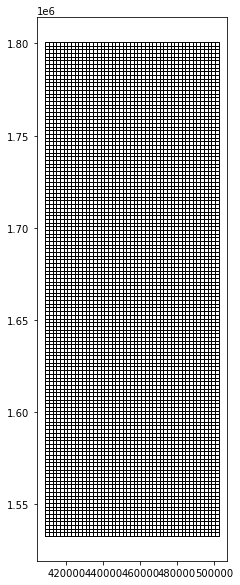

```python
import numpy as np
import pandas as pd
import geopandas as gpd
import os
import shapely
import matplotlib.pyplot as plt
from shapely.geometry import Polygon

```


```python
#reading in data sets
fp = r"data/dma_admn_adm0_py_s1_dominode_v2.shp"
sightings = pd.read_csv('data/sightings2005_2018.csv')
ais = pd.read_csv('data/station1249.csv')
```


```python
#Define variables
projected_EPSG = 2002
geodetic_EPSG = 4326
meters_per_nm = 1852
cell_size = 2000
wide = 2000
length = 2000
```


```python
#read in shape file
dr_shape = gpd.read_file(fp)

dr_shape['geometry'] = dr_shape['geometry'].to_crs(epsg = projected_EPSG)
```


```python
#bootstrap whale sightings and fix time format

geometry = gpd.points_from_xy(sightings['Long'], sightings['Lat'], crs = geodetic_EPSG)
gdf = gpd.GeoDataFrame(sightings, geometry = geometry, crs = geodetic_EPSG)

gdf_time = pd.to_datetime(gdf['GPStime'])

gdf['TIMESTAMP'] = gdf_time

gdf['geometry'] = gdf['geometry'].to_crs(epsg = projected_EPSG)
```


```python
#create initial data exploration/figure

fig, ax = plt.subplots(figsize=(10, 10))
ax.grid(True)
dr_shape.plot(ax = ax, color = "grey")
gdf.plot(ax = ax, color = "red", markersize = 1)
```


    <AxesSubplot:>


    

    


```python
#create grid

xmin, ymin, xmax, ymax  = gdf.total_bounds

xs = list(np.arange(xmin, xmax + cell_size, cell_size))

ys = list(np.arange(ymin, ymax + cell_size, cell_size))
```


```python
#loop

def make_cell(x, y, cell_size):
    ring = [
        (x, y),
        (x + cell_size, y),
        (x + cell_size, y + cell_size),
        (x, y + cell_size)
    ]
    cell = shapely.geometry.Polygon(ring)
    return cell


cells = []
for x in xs:
    for y in ys:
        cell = make_cell(x, y, cell_size)
        cells.append(cell)

```


```python
#make gdf

grid = gpd.GeoDataFrame({'geometry': cells}, crs=2002)

grid['geometry'] = grid['geometry'].to_crs(epsg = 2002)

grid.plot(facecolor = "none", figsize=(10, 10), linewidth = 1 )
```


    <AxesSubplot:>


    

    


```python
#still need to figure out how to join/index/unary union

gdf['geometry'] = gdf['geometry'].to_crs(epsg = projected_EPSG)
joined = grid.sjoin(gdf, how = 'inner')

```


```python
#same as above
grid['count'] = joined.groupby(joined.index).count()['index_right']


grid_sub = grid[grid["count"] >20.0]

unary = grid_sub.geometry.unary_union

convex_hull = unary.convex_hull 

zone = gpd.GeoDataFrame(geometry = gpd.GeoSeries(convex_hull), crs = projected_EPSG)

zone['geometry'] = zone['geometry'].to_crs(epsg = projected_EPSG)

whale_habitat_diff = zone.difference(dr_shape)

whale_habitat = gpd.GeoDataFrame(geometry = whale_habitat_diff)
```


```python
#visualize whale habitat

fig, ax = plt.subplots(figsize=(10, 10))
ax.grid(True)
dr_shape.plot(ax = ax, color = "grey")
whale_habitat.plot(ax = ax, facecolor = "none", edgecolor = "red")
```


    <AxesSubplot:>


    

    


```python
# set geometries
ais_geog = gpd.points_from_xy(ais['LON'], ais['LAT'], crs = geodetic_EPSG)

ais_geo = gpd.GeoDataFrame(ais, geometry = ais_geog)

ais_geo['geometry'] = ais_geo['geometry'].to_crs(epsg = projected_EPSG)
```


```python
#fix time ais data set

ais_time = pd.to_datetime(ais_geo['TIMESTAMP'])

ais_geo['TIMESTAMP'] = ais_time
```


```python
# locate whales within ROI
ais_whale = ais_geo.sjoin(whale_habitat, how = "inner")

ais_sorted = ais_whale.sort_values(['MMSI', 'TIMESTAMP'], ascending = True)

ais_shifted = ais_sorted.shift(periods = 1)
```


```python
#combining rows in data tables
distance = ais_sorted['geometry'].distance(ais_shifted['geometry'])

ais_sorted['distance(m)'] = distance


TIMESTAMP_2 = ais_shifted['TIMESTAMP']

ais_sorted['TIMESTAMP_2'] = TIMESTAMP_2


MMSI_2 = ais_shifted['MMSI']

ais_sorted['MMSI_2'] = MMSI_2
```


```python
#sort df
ais_sorted =  ais_sorted[ais_sorted.MMSI == ais_sorted.MMSI_2]

```


```python
#Calculate time
ais_sorted['delta_time(s)'] = ais_sorted['TIMESTAMP'] - ais_sorted['TIMESTAMP_2']

seconds = ais_sorted['delta_time(s)'] / np.timedelta64(1, 's')

ais_sorted['seconds'] = seconds
```


```python
#calculate average speed
average_speed = ais_sorted['distance(m)'] / ais_sorted['seconds']

ais_sorted['average_speed(m/s)'] = average_speed
```


```python
#calculate NM and seconds at 10 knots
ais_sorted['NM'] = ais_sorted['distance(m)']/meters_per_nm

ais_sorted['time@10knots'] = ais_sorted['NM'] / 10 * 60 * 60
```


```python
#determine difference in time between reduced speed and recorded speeds
ais_sorted['difference_seconds'] = ais_sorted['time@10knots'] - ais_sorted['seconds']
```


```python
#remove positive values
dif_sec_great_zero = ais_sorted.loc[ais_sorted['difference_seconds']>0]
```


```python
sum(dif_sec_great_zero['difference_seconds']/ 60/60/24) 

# 28 days impact travel time for a 10 knot reduction
```


    27.87604044821323


```python
dif_sec_great_zero
```


<div>
<style scoped>
    .dataframe tbody tr th:only-of-type {
        vertical-align: middle;
    }

    .dataframe tbody tr th {
        vertical-align: top;
    }

    .dataframe thead th {
        text-align: right;
    }
</style>
<table border="1" class="dataframe">
  <thead>
    <tr style="text-align: right;">
      <th></th>
      <th>Unnamed: 0</th>
      <th>MMSI</th>
      <th>LON</th>
      <th>LAT</th>
      <th>TIMESTAMP</th>
      <th>geometry</th>
      <th>index_right</th>
      <th>distance(m)</th>
      <th>TIMESTAMP_2</th>
      <th>MMSI_2</th>
      <th>delta_time(s)</th>
      <th>seconds</th>
      <th>average_speed(m/s)</th>
      <th>NM</th>
      <th>time@10knots</th>
      <th>difference_seconds</th>
    </tr>
  </thead>
  <tbody>
    <tr>
      <th>53218</th>
      <td>53218</td>
      <td>203106200</td>
      <td>-61.41927</td>
      <td>15.34898</td>
      <td>2015-04-26 16:08:16</td>
      <td>POINT (461363.603 1696280.393)</td>
      <td>0</td>
      <td>1258.095562</td>
      <td>2015-04-26 16:04:15</td>
      <td>203106200.0</td>
      <td>0 days 00:04:01</td>
      <td>241.0</td>
      <td>5.220314</td>
      <td>0.679317</td>
      <td>244.554213</td>
      <td>3.554213</td>
    </tr>
    <tr>
      <th>84957</th>
      <td>84957</td>
      <td>203518400</td>
      <td>-61.51546</td>
      <td>15.41408</td>
      <td>2015-04-14 17:35:26</td>
      <td>POINT (451023.962 1703455.061)</td>
      <td>0</td>
      <td>2239.743578</td>
      <td>2015-04-14 17:28:32</td>
      <td>203518400.0</td>
      <td>0 days 00:06:54</td>
      <td>414.0</td>
      <td>5.410009</td>
      <td>1.209365</td>
      <td>435.371322</td>
      <td>21.371322</td>
    </tr>
    <tr>
      <th>39279</th>
      <td>39279</td>
      <td>205531510</td>
      <td>-61.40981</td>
      <td>15.35160</td>
      <td>2015-05-02 18:26:15</td>
      <td>POINT (462378.106 1696572.914)</td>
      <td>0</td>
      <td>675.968930</td>
      <td>2015-05-02 18:24:17</td>
      <td>205531510.0</td>
      <td>0 days 00:01:58</td>
      <td>118.0</td>
      <td>5.728550</td>
      <td>0.364994</td>
      <td>131.397848</td>
      <td>13.397848</td>
    </tr>
    <tr>
      <th>139303</th>
      <td>139303</td>
      <td>205571000</td>
      <td>-61.50684</td>
      <td>15.33412</td>
      <td>2015-03-26 09:37:06</td>
      <td>POINT (451968.978 1694613.570)</td>
      <td>0</td>
      <td>662.020878</td>
      <td>2015-03-26 09:35:06</td>
      <td>205571000.0</td>
      <td>0 days 00:02:00</td>
      <td>120.0</td>
      <td>5.516841</td>
      <td>0.357463</td>
      <td>128.686564</td>
      <td>8.686564</td>
    </tr>
    <tr>
      <th>139301</th>
      <td>139301</td>
      <td>205571000</td>
      <td>-61.50115</td>
      <td>15.33156</td>
      <td>2015-03-26 09:39:06</td>
      <td>POINT (452580.343 1694331.833)</td>
      <td>0</td>
      <td>673.159437</td>
      <td>2015-03-26 09:37:06</td>
      <td>205571000.0</td>
      <td>0 days 00:02:00</td>
      <td>120.0</td>
      <td>5.609662</td>
      <td>0.363477</td>
      <td>130.851726</td>
      <td>10.851726</td>
    </tr>
    <tr>
      <th>...</th>
      <td>...</td>
      <td>...</td>
      <td>...</td>
      <td>...</td>
      <td>...</td>
      <td>...</td>
      <td>...</td>
      <td>...</td>
      <td>...</td>
      <td>...</td>
      <td>...</td>
      <td>...</td>
      <td>...</td>
      <td>...</td>
      <td>...</td>
      <td>...</td>
    </tr>
    <tr>
      <th>450065</th>
      <td>71530</td>
      <td>775907000</td>
      <td>-61.41251</td>
      <td>15.26938</td>
      <td>2015-08-31 15:25:58</td>
      <td>POINT (462112.948 1687478.511)</td>
      <td>0</td>
      <td>995.610920</td>
      <td>2015-08-31 15:22:58</td>
      <td>775907000.0</td>
      <td>0 days 00:03:00</td>
      <td>180.0</td>
      <td>5.531172</td>
      <td>0.537587</td>
      <td>193.531280</td>
      <td>13.531280</td>
    </tr>
    <tr>
      <th>450061</th>
      <td>71526</td>
      <td>775907000</td>
      <td>-61.40833</td>
      <td>15.27759</td>
      <td>2015-08-31 15:28:58</td>
      <td>POINT (462559.266 1688387.759)</td>
      <td>0</td>
      <td>1012.882607</td>
      <td>2015-08-31 15:25:58</td>
      <td>775907000.0</td>
      <td>0 days 00:03:00</td>
      <td>180.0</td>
      <td>5.627126</td>
      <td>0.546913</td>
      <td>196.888628</td>
      <td>16.888628</td>
    </tr>
    <tr>
      <th>450059</th>
      <td>71524</td>
      <td>775907000</td>
      <td>-61.40408</td>
      <td>15.28582</td>
      <td>2015-08-31 15:31:59</td>
      <td>POINT (463013.057 1689299.250)</td>
      <td>0</td>
      <td>1018.205189</td>
      <td>2015-08-31 15:28:58</td>
      <td>775907000.0</td>
      <td>0 days 00:03:01</td>
      <td>181.0</td>
      <td>5.625443</td>
      <td>0.549787</td>
      <td>197.923255</td>
      <td>16.923255</td>
    </tr>
    <tr>
      <th>450056</th>
      <td>71521</td>
      <td>775907000</td>
      <td>-61.39967</td>
      <td>15.29361</td>
      <td>2015-08-31 15:34:59</td>
      <td>POINT (463484.122 1690162.135)</td>
      <td>0</td>
      <td>983.093306</td>
      <td>2015-08-31 15:31:59</td>
      <td>775907000.0</td>
      <td>0 days 00:03:00</td>
      <td>180.0</td>
      <td>5.461629</td>
      <td>0.530828</td>
      <td>191.098051</td>
      <td>11.098051</td>
    </tr>
    <tr>
      <th>172907</th>
      <td>172907</td>
      <td>982358863</td>
      <td>-61.40751</td>
      <td>15.34122</td>
      <td>2015-03-14 16:08:23</td>
      <td>POINT (462628.091 1695425.545)</td>
      <td>0</td>
      <td>1086.815697</td>
      <td>2015-03-14 16:04:52</td>
      <td>982358863.0</td>
      <td>0 days 00:03:31</td>
      <td>211.0</td>
      <td>5.150785</td>
      <td>0.586834</td>
      <td>211.260071</td>
      <td>0.260071</td>
    </tr>
  </tbody>
</table>
<p>21246 rows × 16 columns</p>
</div>


